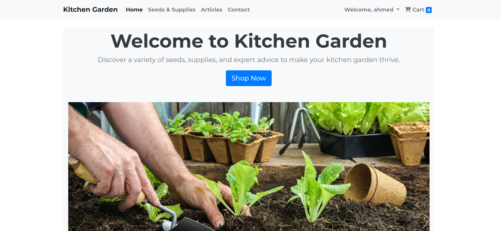
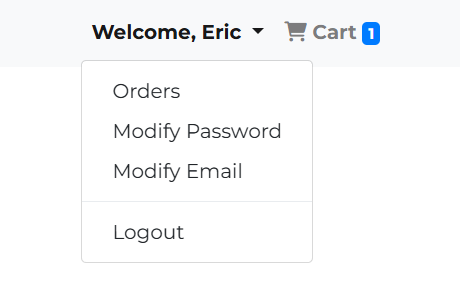
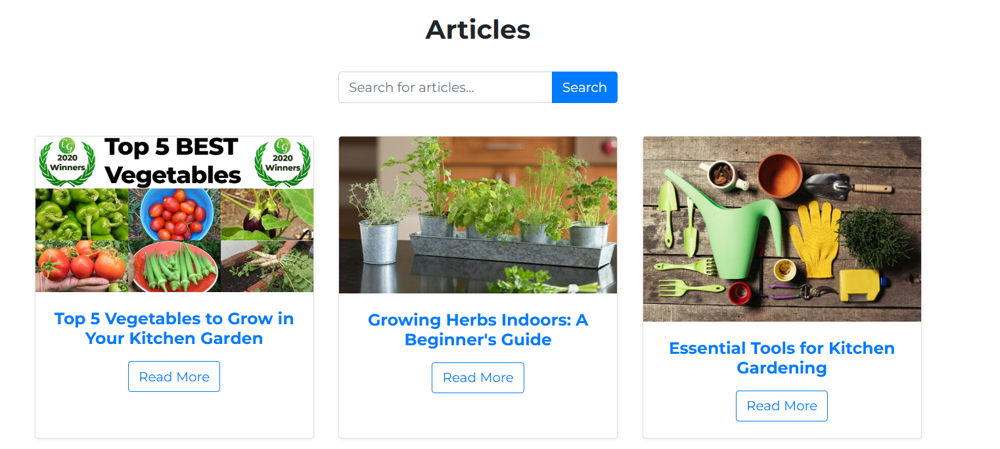
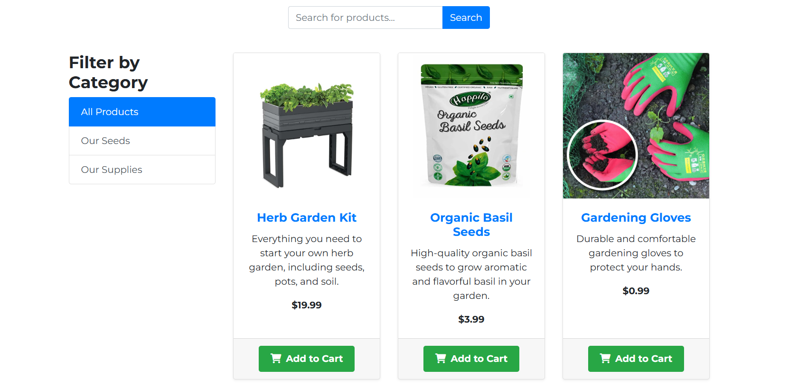
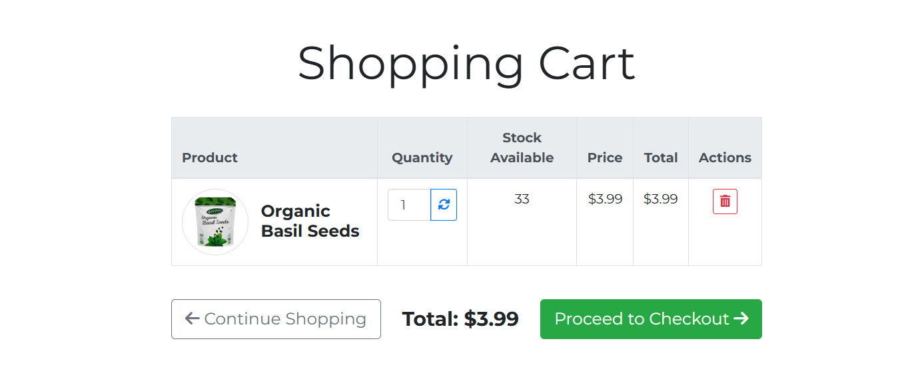
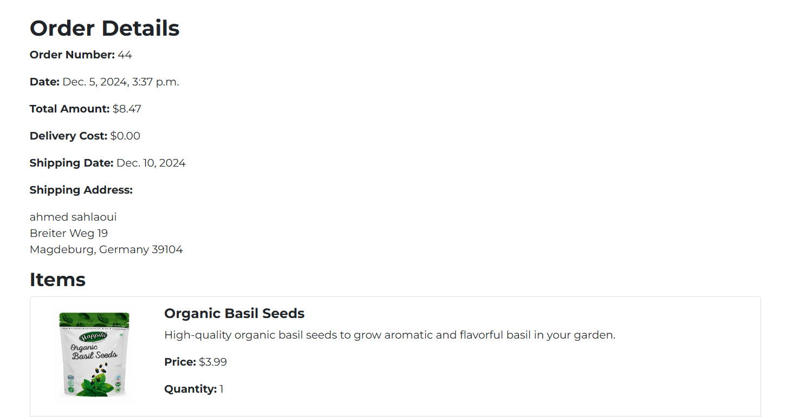
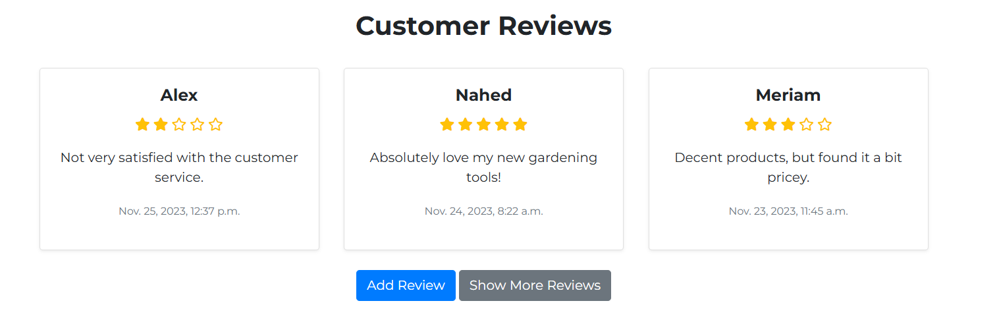
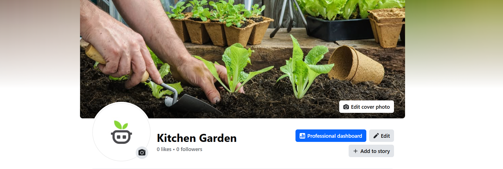
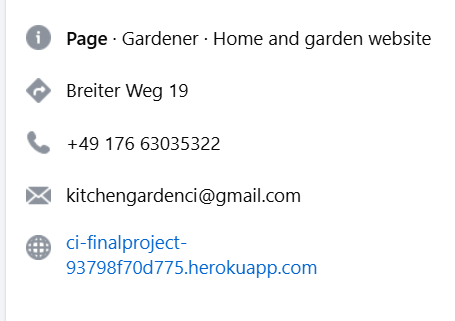
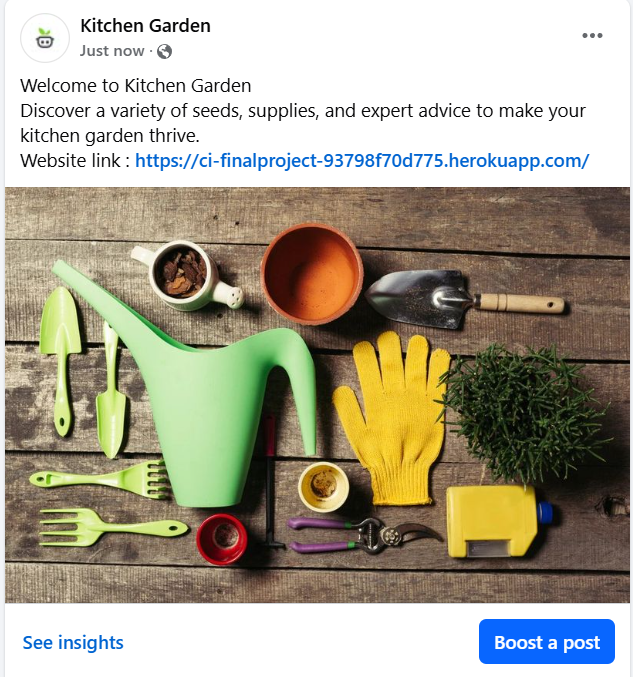

# Kitchen Garden

Welcome to Kitchen Garden – your ultimate destination for all things gardening! Whether you're a seasoned green thumb or just starting your journey into the world of gardening, our platform is designed to cater to your needs with a wide range of gardening supplies and products.

At Kitchen Garden, we believe that everyone deserves a slice of nature, no matter where they live. Our mission is to provide you with the best tools, seeds, and accessories to create your own lush, thriving garden, be it on a balcony, backyard, or a small windowsill. Our carefully curated selection of products ensures that you can cultivate your garden with ease and enjoyment.

Our user-friendly website allows you to browse through an extensive collection of high-quality products, add your favorite items to the cart, and seamlessly checkout with our secure payment system powered by Stripe. With detailed product descriptions, customer reviews, and expert gardening tips, we're here to support you every step of the way.

Join our community of gardening enthusiasts and discover the joy of growing your own plants, herbs, and vegetables. At Kitchen Garden, we are committed to helping you bring the beauty of nature into your home.

Start your gardening adventure with us today and let your garden flourish with Kitchen Garden!

You can access the Kitchen Garden website by clicking [here](https://e-commerce-kitchen-gardening-4bcd684608e0.herokuapp.com/).


## Table of Contents

- [Features](#features)
- [Usage](#usage)
- [Technologies Used](#TechnologiesUsed)
- [User Stories](#UserStories)
- [Apps Overview](#AppsOverview)
- [ERD](#ERD)
- [Website Functionalities](#WebsiteFunctionalities)
- [Automated & Manual Testing](#Automated&ManualTesting)
- [Deployment](#Deployment)
- [Facebook Page Marketing](#FacebookPageMarketing)
- [E-Commerce Business Model and Marketing Strategies](#E-CommerceBusinessModel-and-MarketingStrategies)
- [Future Ideas](#FutureIdeas)


## Features

- User authentication and authorization
- Product listing with search and filter capabilities
- Shopping cart functionality
- Order management
- Checkout system with Stripe integration
- **Educational Articles:** Access a variety of articles and resources designed especially for beginners. Learn about selecting the right plants, understanding soil types, essential gardening tools, and seasonal maintenance tips.
- User-friendly interface

## Usage

Once the development server is running, you can access the application in your web browser at [KitchenGarden](https://e-commerce-kitchen-gardening-4bcd684608e0.herokuapp.com/). From there, you can:

- Browse products
- Add products to your shopping cart
- Proceed to checkout and complete orders
- Manage your account and view order history
- **Read Educational Articles:** New to gardening? Our platform offers a wealth of articles that cover everything you need to get started. From planting tips to seasonal advice, we've got you covered.

## Technologies Used

- Django: Backend framework
- HTML/CSS: Frontend design
- JavaScript: Frontend interactivity
- Stripe: Payment processing
- MySql: Database (for production)
- Python: Programming language

## User Stories

### Store App

- **As a user,** I want to browse a catalog of gardening products so that I can find items to purchase.
- **As a registered user,** I want to add products to my shopping cart so that I can purchase multiple items in one order.
- **As a registered user,** I want to view the items in my shopping cart so that I can review my selections before checkout.
- **As a registered user,** I want to proceed to checkout and provide my shipping information so that I can complete my purchase.
- **As a registered user,** I want to securely pay for my order using Stripe so that I can complete my purchase with confidence.

### Reviews App

- **As a user,** I want to read reviews about the website and services so that I can make informed decisions about using the platform.
- **As a registered user,** I want to leave a review about my experience with the website and services so that I can share feedback with others.
- **As a registered user,** I want to rate the website and services so that I can provide feedback to help improve the platform.

### Articles App

- **As a user,** I want to read articles about gardening so that I can learn more about different gardening techniques and tips.
- **As a user,** I want to search for specific articles so that I can quickly find the information I need.

### Account Management

- **As a user,** I want to create an account so that I can manage my orders and preferences.
- **As a registred user,** I want to log in to my account so that I can access my personal dashboard and order history.
- **As a registred user,** I want to reset my password if I forget it so that I can regain access to my account.

### Website Functionalities

- **As a user,** I can browse and search for gardening products.
- **As a registred user,** I can add products to my shopping cart and review them before checkout.
- **As a registred user,** I can securely complete my purchase using Stripe.
- **As a registered user,** I can read and leave reviews about the website and services.
- **As a user,** I can read articles on various gardening topics.
- **As a registred user,** I can manage my account and view my order history.

## Apps Overview

### Core App

The Core app serves as the backbone of the project, handling essential functionalities such as the home page, contact page, and subscription management. This app ensures that users can navigate the main sections of the website, get in touch through the contact page, and subscribe to newsletters and updates.

**Key Features:**
- Home page management with essential information and navigation links.
- Contact page for users to reach out with inquiries or feedback.
- Subscription functionality to allow users to sign up for newsletters and updates.

### Store App

The Store app is the heart of the Kitchen Garden project, offering a comprehensive catalog of gardening products. Users can browse, search, and filter products, add items to their shopping cart, and proceed to a secure checkout using Stripe. The app also includes features for order management and tracking.

**Key Features:**
- Product catalog with search and filter capabilities.
- Shopping cart functionality.
- Secure checkout with Stripe integration.
- Order management and tracking.

### Articles App

The Articles app provides a wealth of information on various gardening topics. Users can access educational articles, search for specific topics, and filter content based on their interests. This app aims to support users in their gardening journey by offering expert tips and advice.

**Key Features:**
- Access to a library of gardening articles.
- Search and filter functionality for articles.
- Educational content aimed at beginners and experienced gardeners alike.

### Reviews App

The Reviews app enables users to leave feedback about their experiences with the website and services. Users can share their thoughts, rate the overall service, and help others make informed decisions. This app focuses on collecting valuable user input to continually improve the platform and ensure customer satisfaction.

**Key Features:**
- Users can read and write reviews about the website and services.
- Star rating system to provide quantitative feedback.
- Moderation tools to ensure the quality and relevance of reviews.

## ERD

### Article Model

**Entity:** `Article`
- **Attributes:**
  - `id` (Primary Key)
  - `title`: `CharField` (max_length=200)
  - `content`: `TextField`
  - `image`: `ImageField` (upload_to='static/images/articles')
  - `published_date`: `DateTimeField` (default=timezone.now)
  - `updated_date`: `DateTimeField` (auto_now=True)

```plaintext
+-----------------+
|     Article     |
+-----------------+
| id (PK)         |
| title           |
| content         |
| image           |
| published_date  |
| updated_date    |
+-----------------+
```

### Profile Model

**Entity:** `Profile`
- **Attributes:**
  - `id` (Primary Key)
  - `user`: `OneToOneField` (User, on_delete=models.CASCADE)
  - `is_subscribed`: `BooleanField` (default=True)

```plaintext
+-----------------+
|     Profile     |
+-----------------+
| id (PK)         |
| user            |
| is_subscribed   |
+-----------------+
```


### Product Model

**Entity:** `Product`
- **Attributes:**
  - `id` (Primary Key)
  - `name`: `CharField` (max_length=255)
  - `description`: `TextField`
  - `price`: `DecimalField` (max_digits=10, decimal_places=2)
  - `image`: `ImageField` (upload_to='static/images/products')
  - `category`: `CharField` (max_length=50, choices=CATEGORY_CHOICES)
  - `stock`: `PositiveIntegerField` (default=0)
  - `created_at`: `DateTimeField` (auto_now_add=True)
  - `updated_at`: `DateTimeField` (auto_now=True)

```plaintext
+-----------------+
|     Product     |
+-----------------+
| id (PK)         |
| name            |
| description     |
| price           |
| image           |
| category        |
| stock           |
| created_at      |
| updated_at      |
+-----------------+
```


### CartItem Model

**Entity:** `CartItem`
- **Attributes:**
  - `id` (Primary Key)
  - `user`: `ForeignKey` (User, on_delete=models.CASCADE)
  - `product`: `ForeignKey` (Product, on_delete=models.CASCADE)
  - `quantity`: `PositiveIntegerField` (default=1)

```plaintext
+-----------------+
|    CartItem     |
+-----------------+
| id (PK)         |
| user            |
| product         |
| quantity        |
+-----------------+
```


### Order Model

**Entity:** `Order`
- **Attributes:**
  - `id` (Primary Key)
  - `user`: `ForeignKey` (User, on_delete=models.CASCADE)
  - `first_name`: `CharField` (max_length=100)
  - `last_name`: `CharField` (max_length=100)
  - `email`: `EmailField`
  - `address`: `CharField` (max_length=255)
  - `city`: `CharField` (max_length=100)
  - `state`: `CharField` (max_length=100)
  - `zip_code`: `CharField` (max_length=10)
  - `items`: `JSONField` (default=list)
  - `total_amount`: `DecimalField` (max_digits=10, decimal_places=2, default=0.0)
  - `delivery_cost`: `DecimalField` (max_digits=10, decimal_places=2, default=0.0)
  - `shipping_date`: `DateField` (null=True, blank=True)
  - `created_at`: `DateTimeField` (auto_now_add=True)

```plaintext
+-----------------+
|      Order      |
+-----------------+
| id (PK)         |
| user            |
| first_name      |
| last_name       |
| email           |
| address         |
| city            |
| state           |
| zip_code        |
| items           |
| total_amount    |
| delivery_cost   |
| shipping_date   |
| created_at      |
+-----------------+
```


### Review Model

**Entity:** `Review`
- **Attributes:**
  - `id` (Primary Key)
  - `user`: `ForeignKey` (User, on_delete=models.CASCADE)
  - `rating`: `IntegerField` (choices=[(i, i) for i in range(1, 6)])  # Rating from 1 to 5
  - `comment`: `TextField`
  - `created_at`: `DateTimeField` (auto_now_add=True)

```plaintext
+-----------------+
|     Review      |
+-----------------+
| id (PK)         |
| user            |
| rating          |
| comment         |
| created_at      |
+-----------------+
```

## Website Functionalities

Our project offers a wide range of functionalities to enhance user experience and streamline operations. Below is a detailed description of each part of the project:

### Home Page

The home page provides an overview of the website. It's designed to give users a welcoming and intuitive entry point to explore our offerings.


### User Authentication

- **Registration**: Allows new users to create an account by providing their details.
- **Login/Logout**: Enables users to log in to access their account and log out securely.
- **Password Reset**: Provides functionality for users to reset their password via email.

### User Profile


- **View Profile**: Users can view their profile information including their subscription status.
- **Edit Profile**: Users can update their personal information, including changing their password and e-mail.

### Articles


- **View Articles**: Users can browse a list of articles and read individual articles.
- **Search Articles**: Users can search for articles by keywords.
- **Superuser Functionality**:
  - **Add Article**: Superusers can add new articles to the platform.
  - **Edit Article**: Superusers can edit existing articles.
  - **Delete Article**: Superusers can delete articles.

### Products


- **View Products**: Users can browse a list of products, view product details, and search for products by category.
- **Add to Cart**: Users can add products to their shopping cart and update quantities.
- **Checkout**: Users can proceed to checkout, enter their shipping details, and make payments using Stripe.
- **Superuser Functionality**:
  - **Add Product**: Superusers can add new products to the platform.
  - **Edit Product**: Superusers can edit existing products.
  - **Delete Product**: Superusers can delete products.

### Cart


- **View Cart**: Users can view items in their cart, update quantities, and remove items.
- **Checkout**: Users can proceed to checkout from their cart.

### Orders


- **Order History**: Users can view their past orders and order details.
- **Order Details**: Provides detailed information about individual orders, including shipping status.

### Reviews


- **Submit Review**: Users can submit reviews for products they have purchased.
- **View Reviews**: Users can view reviews submitted by other users for each product.

### Subscription


- **Subscribe/Unsubscribe**: Users can manage their subscription status, opting in or out of newsletters and special offers.
- **Subscription Status**: Users can view their current subscription status in their profile.

### Admin Panel

- **User Management**: Superusers can manage user accounts, including creating, editing, and deleting users.
- **Content Management**: Superusers can manage website content, including products, articles, and reviews.
- **Order Management**: Superusers can view and manage orders placed by users.

These functionalities work together to provide a seamless and robust experience for both users and administrators. By leveraging these features, we aim to create an engaging and user-friendly platform that meets the needs of our community.

## Automated & Manual Testing

### Overview

Our project employs the Django `TestCase` framework to ensure the reliability and robustness of the application's functionality. Automated tests help us catch bugs early, verify that our code behaves as expected, and maintain the quality of the codebase as the project evolves.

### Testing Features

1. **Models Tests**: We have written tests to validate the behavior of our models, ensuring that data integrity and relationships are maintained.
    - **Article Model**: Tests include creating and retrieving articles, verifying default values, and testing string representations.
    - **Profile Model**: Tests focus on creating user profiles, checking subscription status, and user associations.
    - **Product Model**: Includes tests for creating products, validating category choices, and stock management.
    - **CartItem Model**: Tests for adding items to the cart, updating quantities, and user associations.
    - **Order Model**: Tests for creating orders, verifying order details, and JSON field validations for order items.
    - **Review Model**: Includes tests for creating reviews, rating validations, and string representations.

2. **Views Tests**: These tests check the responses of our views, ensuring that the correct templates are rendered and that the views behave correctly under various conditions.
    - **Store Views**: Tests for browsing products, viewing product details, adding products to the cart, and checkout process.
    - **Review Views**: Includes tests for submitting and displaying reviews, rating validation, and review moderation.
    - **Articles Views**: Tests for displaying a list of articles, viewing individual articles, and ensuring the articles are correctly rendered.
    - **Subscription Views**: Tests for managing subscriptions, including subscribing and unsubscribing actions.
    - **Superuser Functionality**: 
      - **Add Product**: Tests that a superuser can add a new product.
      - **Edit Product**: Tests that a superuser can edit an existing product.
      - **Delete Product**: Tests that a superuser can delete a product.
      - **Add Article**: Tests that a superuser can add a new article.
      - **Edit Article**: Tests that a superuser can edit an existing article.
      - **Delete Article**: Tests that a superuser can delete an article.

3. **Forms Tests**: Form tests ensure that our forms handle input correctly and provide appropriate validation messages.
    - **Order Forms**: Includes tests for validating shipping details and payment information during checkout.
    - **Review Forms**: Tests for rating selection, comment validation, and form submission.

### Manual Testing Checklist

To ensure the application's functionality and performance,We followed this manual testing checklist:

#### User Registration and Authentication
- **Register a new user**: Go to the registration page and fill out the form.
- **Log in and log out**: Log in with the new account and check access to restricted areas.
- **Password reset**: Test password reset functionality.

#### Product Management
- **Add a new product**: Log in as a superuser, add a new product, and verify it appears in the product listing.
- **Edit an existing product**: Edit an existing product and check the changes.
- **Delete a product**: Delete a product and ensure it is removed from the listing.

#### Shopping Cart
- **Add products to the cart**: Add products to the cart from the product listing.
- **Update quantities and remove items**: Update quantities and remove items in the cart.
- **Check cart totals**: Ensure the cart displays correct totals.

#### Checkout Process
- **Fill out shipping information**: Proceed to checkout and fill out the shipping form.
- **Stripe payment processing**: Complete the payment process using Stripe's test mode.
- **Order confirmation**: Verify successful order creation and email notifications.

#### Order Management
- **View order history**: View order history and details from the user account page.

#### Access Controls
- **Admin functionalities**: Ensure non-superusers cannot access admin functionalities.
- **Permissions**: Verify permissions for different user roles.

#### Responsive Design
- **Test on different devices**: Use browser developer tools to simulate different devices and screen sizes.

#### Performance Testing
- **Check page load times**: Monitor response times and ensure smooth navigation across the site.

### Note to Assessors : 

I wanted to inform you that some of the tests for my project have failed. I am fully aware of these issues and I am committed to resolving them as soon as possible. Please understand that I will make every effort to debug and fix these tests in the near future to ensure the functionality and reliability of the application. Your understanding and patience during this process are greatly appreciated. Thank you for your consideration.


## Deployment

This project is deployed to Heroku using the GitHub integration. We follow the steps below to deploy a version of this project.

### Steps to Deploy

1. **Create a Heroku App**:
   - Log in to a Heroku account and create a new app by clicking the "New" button on the dashboard and selecting "Create new app." Provide the app a unique name and select the appropriate region.

2. **Connect GitHub Repository**:
   - In the Deploy tab of the newly created app, locate the "Deployment method" section.
   - Select "GitHub" as the deployment method.
   - Connect the GitHub account and select the repository to deploy.

3. **Environment Variables**:
   - Set up environment variables in the "Settings" tab of the Heroku app. Add the following environment variables:
     - `SECRET_KEY`: The Django secret key.
     - `DATABASE_URL`: The database URL.
     - `STRIPE_PUBLIC_KEY`: Your Stripe public key.
     - `STRIPE_SECRET_KEY`: Your Stripe secret key.
     - `EMAIL_HOST_USER`: The email host user.
     - `EMAIL_HOST_PASSWORD`: The email host password.
4. **Procfile**:
   - Ensure a `Procfile` with the following content is present:
     ```
        web: gunicorn kitchen_garden.wsgi
     ```

5. **Collect Static Files**:
   - Ensure `settings.py` is configured to collect static files. Add the following settings:
     ```python
     STATIC_ROOT = os.path.join(BASE_DIR, 'staticfiles')
     STATIC_URL = '/static/'

     # Extra places for collectstatic to find static files.
     STATICFILES_DIRS = (
         os.path.join(BASE_DIR, 'static'),
     )
     ```

     Note on Static Files Storage:
          For this project, we have utilized Amazon Web Services (AWS) S3 to store our static files. This setup helps to efficiently manage and serve static content, enhancing the performance and scalability of the application. The configuration for AWS S3 is included in the settings.py file, ensuring seamless integration and management of static assets.

6. **Push to GitHub**:
   - Ensure all changes are committed to the GitHub repository.

7. **Deploy via Heroku Dashboard**:
   - In the Deploy tab, scroll down to the "Manual deploy" section.
   - Select the main branch.
   - Click "Deploy Branch."

## Facebook Page Marketing

Our Facebook page is a powerful tool for connecting with our audience and promoting our project. Here’s how we can make the most of it:





### Page Setup
- **Profile and Cover Photos**: Use high-quality images for the profile and cover photos that represent our brand and project.
- **About Section**: Fill out the about section with a compelling description of our project, contact information, and links to our website and other social media profiles.

### Content Strategy
- **Regular Posts**: Share updates, new features, behind-the-scenes content, and user-generated content regularly to keep the audience engaged.
- **Visual Content**: Use images, videos, and infographics to make posts more engaging. Visual content tends to get more interaction and shares.
- **Stories**: Utilize Facebook Stories to share quick updates and behind-the-scenes content that disappear after 24 hours, creating a sense of urgency.
- **Live Videos**: Host live Q&A sessions, tutorials, and announcements to engage with the audience in real-time and build a personal connection.



### Engagement
- **Respond to Comments**: Actively respond to comments and messages to build a community and make followers feel valued.
- **Encourage Interaction**: Ask questions, create polls, and encourage followers to share their opinions and experiences related to our project.

### Advertising
- **Facebook Ads**: Create targeted ad campaigns to reach a larger audience. Use demographic, interest-based, and behavior targeting to get the best results.
- **Boosted Posts**: Boost high-performing posts to increase their reach and engagement.
- **Analytics**: Regularly review Facebook Insights to track the performance of posts and ads. Adjust the strategy based on what works best.

By implementing these strategies, we can effectively use our Facebook page to increase visibility, engage with our audience, and drive growth for our project.

## E-Commerce Business Model and Marketing Strategies

### E-Commerce Business Model

The Kitchen Garden project is built on a B2C (Business-to-Consumer) e-commerce model. This model focuses on selling gardening products directly to end consumers through our online platform. Our business aims to provide a seamless and convenient shopping experience for home gardeners looking for quality products and expert advice.

**Key Components of Our E-Commerce Business Model:**

1. **Product Offerings**:
   - A wide range of gardening products including seeds, tools, and supplies.
   - Detailed product descriptions, images, and user reviews to assist customers in making informed decisions.

2. **User Experience**:
   - Intuitive website design with easy navigation and search functionality.
   - Secure user authentication and personalized user accounts.
   - Shopping cart and streamlined checkout process with Stripe payment integration.

3. **Order Fulfillment**:
   - Efficient order processing and fulfillment system.
   - Real-time inventory management to ensure product availability.
   - Reliable shipping options and order tracking.

4. **Customer Support**:
   - Comprehensive FAQs and contact options for customer inquiries.
   - Newsletter subscription for updates and gardening tips.
   - User-friendly return and refund policies.

### Marketing Strategies

To attract and retain customers, the Kitchen Garden project employs various marketing strategies:

1. **Content Marketing**:
   - Regular blog posts and articles on gardening tips, techniques, and trends to engage and educate our audience.
   - High-quality images and videos showcasing our products and their benefits.

2. **Social Media Marketing**:
   - Active presence on platforms like Facebook, Instagram, Twitter, and LinkedIn to connect with our audience.
   - Regular posts, stories, and live videos to share updates and promote products.
   - Engaging with followers through comments, messages, and social media contests.

3. **Email Marketing**:
   - Building an email list to send newsletters, promotions, and personalized content.
   - Automated email campaigns for abandoned cart recovery and customer re-engagement.

4. **Search Engine Optimization (SEO)**:
   - Optimizing website content and product descriptions for relevant keywords to improve search engine rankings.
   - Creating a sitemap and using meta tags to enhance visibility on search engines.

5. **Paid Advertising**:
   - Running targeted ads on Google and social media platforms to reach potential customers.
   - Utilizing retargeting ads to convert visitors into buyers.

6. **Influencer Partnerships**:
   - Collaborating with gardening influencers and bloggers to promote our products and reach a wider audience.
   - Offering affiliate programs for influencers to earn commissions on sales generated through their referrals.

7. **Customer Reviews and Testimonials**:
   - Encouraging customers to leave reviews and share their experiences with our products.
   - Highlighting positive reviews and testimonials on our website and social media channels.

By implementing these strategies, the Kitchen Garden project aims to build a loyal customer base, increase brand awareness, and drive sales growth.


## Future Ideas

- **Enhanced Product Search**: Implement advanced search functionality with filters for price range, categories, ratings, etc.
- **Product Reviews and Ratings**: Allow users to leave reviews and ratings for products to help other customers make informed decisions.
- **Wishlist Feature**: Enable users to create and manage wishlists for products they are interested in purchasing later.
- **Discount Coupons and Promotions**: Integrate a system for applying discount coupons and running promotional campaigns.
- **Order Tracking**: Provide real-time order tracking information for customers to monitor their shipments.
- **Multi-language Support**: Add support for multiple languages to cater to a broader audience.
- **Mobile App**: Develop a mobile application to offer a seamless shopping experience on smartphones and tablets.
- **Subscription Service**: Introduce subscription-based products or services for recurring purchases.
- **AI-Powered Recommendations**: Use machine learning to provide personalized product recommendations based on user behavior and preferences.
- **Social Media Integration**: Allow users to share their purchases and favorite products on social media platforms.
- **Analytics Dashboard**: Create an admin dashboard with detailed analytics and reports on sales, user behavior, and more.
- **Customer Support Chatbot**: Implement an AI-powered chatbot to assist customers with their inquiries and issues in real-time.
- **Advanced Payment Options**: Include additional payment methods such as digital wallets, cryptocurrencies, and installment plans.
